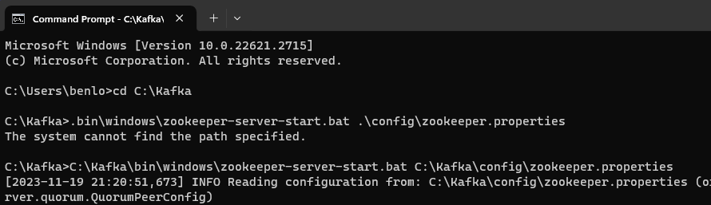
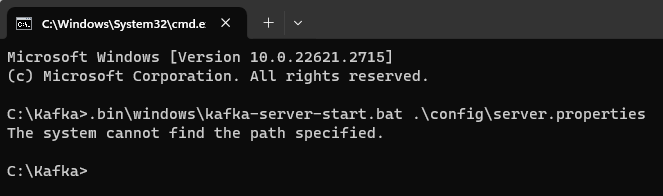
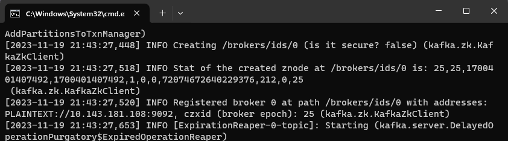
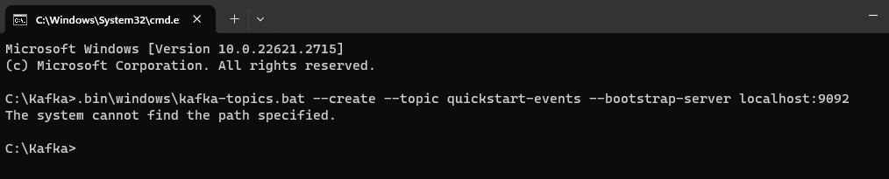
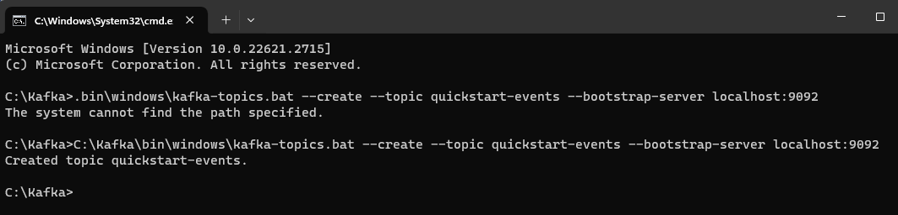
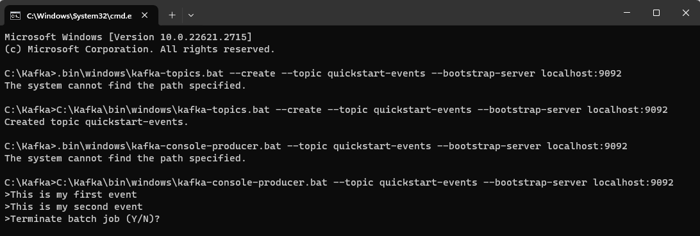
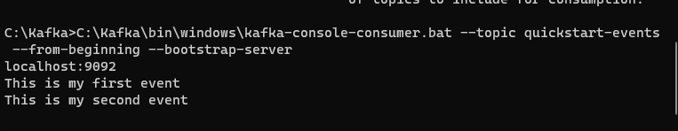

# Kafka Get Started 
This document is for note the step I setup Kafka, the problem I faced when setting up the Kafka and the solution.
If got issue with setup kafka in machine (laptop, pc), then can review the kafka documentation [Kafka Documentation](https://kafka.apache.org/documentation/)
  This is Kafka Setup Steps [Kafka QuickStart](https://kafka.apache.org/quickstart)
  Follow this youtube for those using windows OS, the video is following Kafka QuickStart [How to Install Apache Kafka on Windows](https://www.youtube.com/watch?v=aKDWWICgfA0)

# Step to setup Kafka
**NOTE: Your local environment must have Java 8+ installed.**
**It might take 1 week above until 1 month to setup Kafka**
1. Download latest Kafka 3.6.0. [Kafka Download Link](https://www.apache.org/dyn/closer.cgi?path=/kafka/3.6.0/kafka_2.13-3.6.0.tgz)
2. Extract the kafka tgz file.
3. Open command prompt and **cd** to Kafka file
   In order to start zookeeper, copy this **.\bin\windows\zookeeper-server-start.bat .\config\zookeeper.properties** and paste into command prompt and press Enter key (to verify whether zookeeper service running or not)
   
    You might face this problem **The system cannot find the path specified.** when use the code line. Try to use **C:\Kafka\bin\windows\zookeeper-server-start.bat C:\Kafka\config\zookeeper.properties**
    for mine zookeeper port is port **0.0.0.0/0.0.0.0:2181**. If you get this then it means your zookeeper is successfully running.
     
4. Next, need to start kafka server. Open new command prompt and cd to Kafka file, copy **.bin\windows\kafka-server-start.bat .\config\server.properties** paste into command prompt and press Enter key.
   
    You might face this problem **The system cannot find the path specified.** when use the code line. Try to use **C:\Kafka\bin\windows\kafka-server-start.bat C:\Kafka\config\server.properties**
   
    for mine kafka port is 9092 as shown the photo above as its mean the server is started.
     
5. Right now we need to create a topic to store events. Open new command prompt and cd to Kafka file, copy **.bin\windows\kafka-topics.bat --create --topic quickstart-events --bootstrap-server localhost:9092** paste into command prompt and press Enter key.
   
    You might face this problem **The system cannot find the path specified.** when use the code line. Try to use **C:\Kafka\bin\windows\kafka-topics.bat --create --topic quickstart-events --bootstrap-server localhost:9092**
   
     **Created topic quickstart-events.** shows that you have successfully created the topic.
     
6. After successful create topic, now we need to write some events into the topic. copy **.bin\windows\kafka-console-producer.bat --topic quickstart-events --bootstrap-server localhost:9092** and paste into command prompt and press Enter key. **You could customize your event topic**
    You might face this problem **The system cannot find the path specified.** As previously same issues just replace the **.** in line code to **C:\Kafka**. Its depends on where you locate the Kafka file at.
      its will show *>* symbol after you execute the code, then just key in your event and press Enter.
   
      Press **ctrl + c** in order to terminate the entering process as shown above.
7. Next is Read the Events. Open another Command prompt to read the events you just created. Copy **C:\Kafka\bin\windows\kafka-console-consumer.bat --topic quickstart-events --from-beginning --bootstrap-server
   localhost:9092** and paste into command prompt and press Enter key.
   

Next is Import/export your data as streams of events with Kafka Connect
    